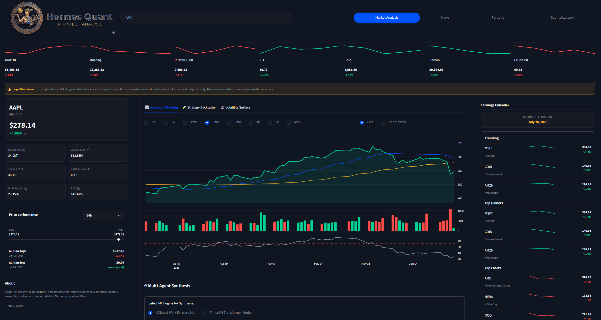
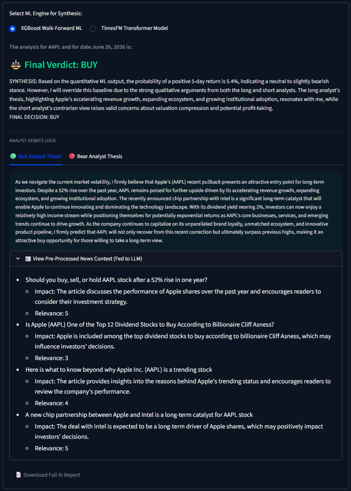
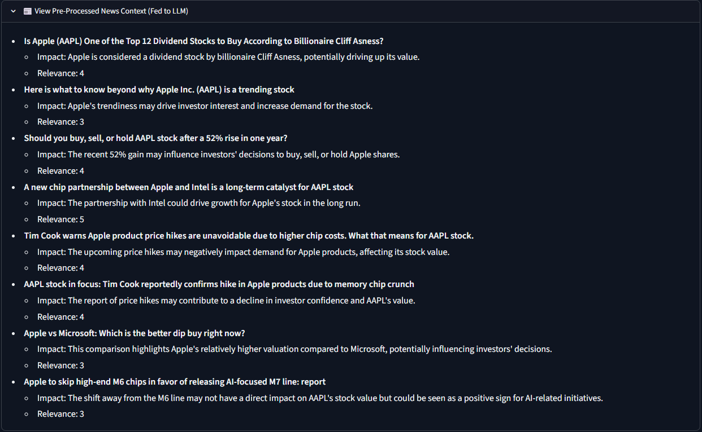
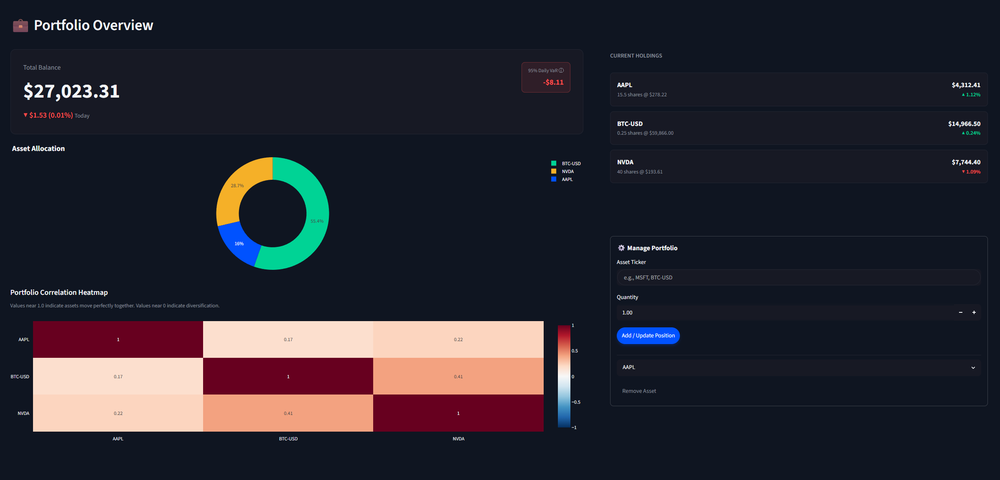
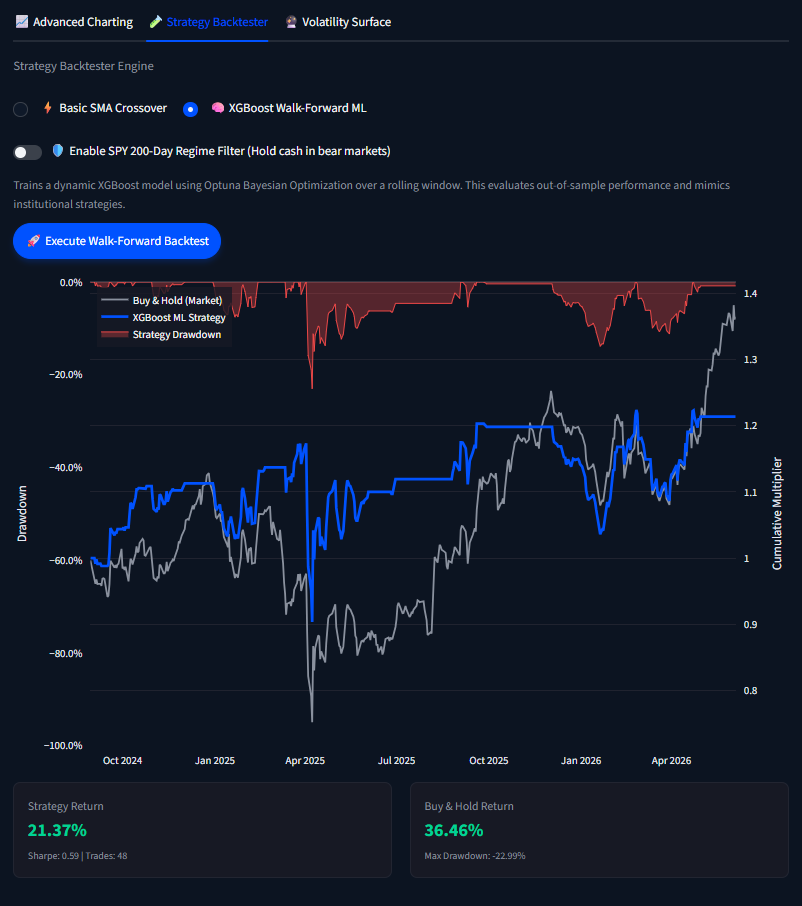

# 📈 Institutional AI Trading Terminal


A Bloomberg-inspired quantitative trading terminal that bridges the gap between traditional financial engineering and state-of-the-art Generative AI. This platform features an autonomous multi-agent debate system, machine learning walk-forward backtesting, and a real-time Retrieval-Augmented Generation (RAG) news pipeline.


*(Main dashboard featuring dynamic asset routing, Plotly charting, and a miniaturized macro ticker tape engineered via custom CSS overrides.)*

---

## 🎯 The Vision & Thought Process

The intersection of AI and finance is often plagued by "wrapper" apps that simply pipe stock tickers into ChatGPT. I built this terminal to solve the fundamental flaws of that approach. Large Language Models are terrible at raw math, highly prone to hallucination when evaluating numerical trends, and suffer from context-window degradation when fed raw news data.

**The solution was to build a decoupled, pipeline-driven architecture:**

1. Let **Machine Learning models (XGBoost/TimesFM)** handle the heavy quantitative lifting (math, probabilities, volatility scaling).
2. Let a **ChromaDB RAG Pipeline** handle the data ingestion and noise reduction.
3. Let the **LLMs (Llama 3)** do what they do best: synthesize context, debate opposing viewpoints, and manage risk parameters.

---

## ✨ Core Architecture & Features

### 🤖 Multi-Agent AI Synthesis

Simulates an institutional investment committee. Instead of a single prompt, the system spins up multiple local agents (via Ollama):

* **The Bull Analyst:** Argues the upside case using technical breakouts and positive RAG catalysts.
* **The Bear Risk Manager:** Actively tries to poke holes in the thesis, highlighting macroeconomic headwinds or bearish technical divergences.
* **The Portfolio Manager (PM):** Reviews the XGBoost mathematical baseline or the TImesFm transformer baseline, weighs the Bull vs. Bear arguments, and outputs a strict JSON/Regex-parsable `BUY`, `HOLD`, or `SELL` verdict.


### 🧠 Machine Learning Engine

Users can toggle between two distinct forecasting models:

* **XGBoost Walk-Forward:** A dynamic gradient boosting model that trains on a rolling 750-day window and tests on blind 63-day out-of-sample data, mitigating the primary sin of retail backtesting: "Curve Fitting."
* **Google TimesFM:** A state-of-the-art zero-shot time-series transformer model that generates 5-day predictive probability bands (P10 to P90 percentiles).

### 📰 RAG-Powered News Pre-processor

Scrapes live financial news via DuckDuckGo and embeds it into a local ChromaDB vector database. A lightweight LLM compresses unstructured articles into a high-density, sentiment-scored context block (Impact & Relevance mapping) before feeding it to the primary agents.

### 💼 Dynamic Portfolio & Risk Management

* **95% Historical Value at Risk (VaR):** Calculates maximum expected daily drawdown based on historical volatility.
* **Live Correlation Matrix:** Maps inter-asset relationships to ensure proper diversification.
* **Dynamic Asset Branching:** The UI intelligently adapts its metrics based on the asset class (e.g., swapping Equities' P/E ratios for Crypto's Circulating Supply).


*(Real-time portfolio tracking featuring 95% Daily VaR and asset correlation matrices.)*

---

## 🧪 Engineering Journey: Successes & Failures

Building a system this complex required iterating through several failed paradigms. Here are the key technical pivots:

### ❌ Failure 1: Context Overflow with Raw News Data

* **The Attempt:** Initially, I scraped 5 full financial articles and dumped them directly into the LLM's prompt.
* **The Result:** The local LLM (Llama 3 8B) choked. Inference times spiked to over 45 seconds, the model suffered from "lost in the middle" syndrome, and it started hallucinating financial metrics.
* **The Fix:** Built a **Pre-processor LLM Agent**. Now, articles are fetched, embedded into ChromaDB, and a tiny, fast LLM passes over them to extract exactly two things: a 1-sentence Impact Summary and a 1-5 Relevance Score. This slashed token usage by 90% and resulted in hyper-accurate PM decisions.

### ❌ Failure 2: The "Infinite Liquidity" Backtest Trap

* **The Attempt:** The V1 backtester used a basic vectorized Pandas approach to test Simple Moving Average (SMA) crossovers over 5 years. It returned 800% profit.
* **The Result:** Pure curve-fitting delusion. Vectorized backtesters assume you buy exactly at the close, with zero slippage, regardless of broader market crashes.
* **The Fix:** Built the `MLQuantBacktester`. Added **Walk-Forward Optimization** to test on blind out-of-sample data, and implemented a **Dynamic Regime Filter** that forces the algorithm to hold cash if the S&P 500 (SPY) drops below its 200-day moving average.

### ❌ Failure 3: Streamlit UI Grid Collapse

* **The Attempt:** Tried to build a dense, Bloomberg-style Top Macro Ticker Tape by nesting tiny Streamlit columns horizontally.
* **The Result:** Streamlit's native grid system enforces strict min-widths and 16px padding. The UI broke, pushing charts onto new lines and clipping elements off the screen.
* **The Fix:** Wrote aggressive CSS injections via `st.markdown(unsafe_allow_html=True)`. Stripped `stHorizontalBlock` padding to 0, forced Plotly containers to strict heights, and stacked the sparkline charts vertically above the text to achieve a highly responsive, institutional-grade layout.

---

## 📊 Quantitative Walk-Forward Backtesting



*(Walk-Forward XGBoost ML Backtest comparing strategy returns against a Buy & Hold baseline, featuring drawdown tracking.)*

The terminal evaluates strategies not just on total return, but on institutional benchmarks including Maximum Drawdown, Sharpe Ratio, and Alpha generation relative to SPY.

---

## 🚀 Installation & Setup


### Prerequisites

* Python 3.13+

* [Ollama](https://ollama.ai/) installed locally and running (with `llama3` or your preferred model pulled).

* *Optional but recommended:* A CUDA-compatible GPU for accelerated TimesFM/XGBoost inference.

### Quickstart

1. **Clone the repository:**

   ```bash
   git clone [https://github.com/danielkiani/hermes_quant.git](https://github.com/danielkiani/hermes_quant.git)
   cd ai-trading-terminal
   ```
3. **Create a virtual environment and install dependencies:**
   ```bash
   python -m venv venv
   source venv/bin/activate  # On Windows: venv\Scripts\activate
   pip install -r requirements.txt
   ```

4. **Start the local LLM server:**

   Ensure Ollama is running in the background.

   ```bash
   ollama run llama3
   ```

5. **Launch the Terminal:**

   ```bash
   streamlit run src/app.py
   ```


## 🔮 Future Roadmap

While the terminal serves as a robust research environment, the transition from Research to Live Execution requires further architectural upgrades:

1. **Event-Driven Backtesting Engine:** Transitioning from the current vectorized backtester to an event-driven queue system to accurately model intra-bar slippage, limit order books, and latency.

2. **Live Broker Integration:** Connecting the PM Agent's final outputs to a paper-trading API (like Alpaca or Interactive Brokers) for forward-testing in live markets.

3. **Alternative Data Ingestion:** Expanding the RAG pipeline to ingest SEC EDGAR 10-K/10-Q filings for fundamental equities analysis, and Glassnode on-chain metrics for crypto assets.

## ⚠️ Legal Disclaimer

This software is for educational and research purposes only. The AI-generated analyses, predictive models, and backtested results do not constitute financial or investment advice. Real-world trading carries significant risk. Do not deploy real capital based on the outputs of this application.

Built by Daniel Kiani - 2026