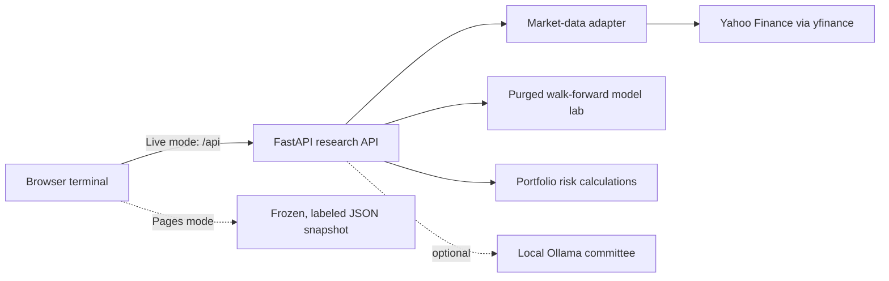

<p align="center">
  
</p>

<h1 align="center">Hermes Quant</h1>

<p align="center">
  <strong>Evidence before conviction.</strong><br />
  An evidence-led market research terminal for cross-asset context, model validation,
  strategy simulation, inspectable AI synthesis, and portfolio risk.
</p>

<p align="center">
  <a href="https://danielkiani.github.io/hermes_quant/"><strong>Open the cinematic demo</strong></a>
  ·
  <a href="#run-the-live-application">Run locally</a>
  ·
  <a href="#research-methodology">Research methodology</a>
</p>

<p align="center">
  
  
  
  
  <a href="https://github.com/DanielKiani/hermes_quant/actions/workflows/ci.yml"></a>
</p>


Hermes Quant is a research environment—not a broker, signal-selling product, or live
execution system. It keeps observed provider data, derived analytics, model estimates,
historical simulations, and generated text visibly distinct. If data is unavailable,
the interface says so instead of inventing a fallback value.

## Explore the terminal

### Market Command Center

The default desk combines a continuously moving cross-asset tape, macro pulse,
independent trending/gainer/loser screens, upcoming events, and source-linked news.


### Market analysis

The analysis desk provides line and candlestick views, volume, RSI, moving averages,
linear/log scales, exact-value hover, fundamentals, macro context, movers, news, and
provenance for equities and crypto.


### Strategy research

The backtester supports fixed SMA rules and purged walk-forward ML research. It exposes
the target horizon, position policy, probability thresholds, regime filter, execution
lag, commission, slippage, risk-free rate, annualization basis, turnover, cost drag,
drawdown, and per-fold evidence.


### Inspectable AI committee

A quantitative prior is challenged by separate bullish and bearish analysts before a
portfolio judge explains whether it follows or overrides the model. Generated claims
remain subordinate to indexed source evidence.


### Portfolio and news

The browser-local demonstration portfolio shows provider-delayed valuation, allocation,
historical one-day VaR, and aligned return correlation. The news workspace keeps selected-
asset and wider-market headlines separate and includes provider thumbnails.


## Live application and GitHub Pages demo

Hermes has two deliberately different operating modes:

| Mode | Data | Available features | Purpose |
| --- | --- | --- | --- |
| Live local app | Provider-delayed Yahoo Finance data through FastAPI | Full market terminal, configurable backtests, options metadata, editable portfolio, and optional local Ollama committee | Development and research |
| GitHub Pages | A clearly labeled frozen snapshot committed in `frontend/demo/snapshot.json` | Landing page, equity/crypto overview, selected terminal views, source headlines/events, demo portfolio, and a fixed-parameter SMA result | Stable, serverless portfolio demonstration |

The Pages build never presents frozen values as live. Server-dependent actions that
cannot be reproduced honestly—such as arbitrary backtests, listed-options retrieval,
portfolio mutation, and Ollama generation—are disabled with explicit explanations.

## Architecture


```mermaid
flowchart LR
    Browser[Browser terminal] -->|Live mode: /api| API[FastAPI research API]
    API --> Market[Market-data adapter]
    Market --> Yahoo[Yahoo Finance via yfinance]
    API --> Models[Purged walk-forward model lab]
    API --> Risk[Portfolio risk calculations]
    API -. optional .-> Ollama[Local Ollama committee]

    Browser -. Pages mode .-> Snapshot[Frozen, labeled JSON snapshot]
```

The current frontend is framework-free HTML, CSS, and JavaScript. Nginx serves it in
Docker and proxies `/api/` to the backend. FastAPI can also serve the same files directly
during local development. The original Streamlit prototype remains at `src/app.py` as a
historical reference; it is not the production entry point.

## Research methodology

The model lab predicts whether the close will be higher after a configurable horizon.
It compares regularized logistic regression with XGBoost; `auto` admits the nonlinear
candidate only when it improves validation log loss inside the training window.

Each outer fold:

1. Selects a chronological training window.
2. Reserves its trailing segment for inner validation.
3. Purges the target horizon at inner and outer boundaries.
4. Tunes and compares candidates without looking at the outer test period.
5. Refits the selected candidate on the eligible outer training data.
6. Evaluates once on the untouched outer test window.

Responses expose fold boundaries, selected model, validation/test log loss, Brier score,
balanced accuracy, embargo length, target definition, and known exclusions. Simulated
returns use a one-observation execution lag and configurable transaction costs.

Equities use exchange-day observations and 252-day annualization; crypto uses continuous
daily observations and 365-day annualization. Futures, FX, and options strategies are not
silently generalized from those profiles because their sessions, rolls, funding, expiry,
and contract mechanics require dedicated implementations.

## Run the live application

### Docker

```bash
docker compose up --build
```

Open `http://localhost:8080`.

### Local development

```powershell
python -m venv .venv
.\.venv\Scripts\Activate.ps1
python -m pip install -r requirements-dev.txt
$env:HERMES_SERVE_FRONTEND="1"
python -m uvicorn src.backend.main:app --host 127.0.0.1 --port 8080
```

On macOS/Linux, activate `.venv/bin/activate` and prefix the server command with
`HERMES_SERVE_FRONTEND=1`.

Market, portfolio, and model-research features do not require Ollama. Generated committee
analysis does; the Docker backend expects it at `http://host.docker.internal:11434`.

## Build and publish the Pages demo

With the local API running, refresh the frozen demonstration data and build the exact
artifact GitHub Pages will publish:

```powershell
.\.venv\Scripts\python.exe scripts\export_demo_snapshot.py
.\.venv\Scripts\python.exe scripts\build_pages.py
```

Preview the resulting `_site/` directory through an HTTP server—not by opening
`index.html` directly—so module and subpath behavior matches deployment.

The workflow at `.github/workflows/pages.yml` builds and deploys `_site/` on pushes to
`main` or manual dispatch. In the repository's **Settings → Pages**, select
**GitHub Actions** as the publishing source once; subsequent deployments are automatic.
All app and media URLs are relative, so the site works at the repository subpath
`/hermes_quant/`.

## Verification

```bash
python -m pytest -q
node --check frontend/app.js
node --check frontend/demo-data.js
python scripts/build_pages.py
```

The suite covers target construction, chronological splits, leakage guards, API error
contracts, evidence labels, frontend asset contracts, the frozen-demo manifest, and the
Pages workflow. CI executes the same build and checks on pushes and pull requests.

## API surface

| Method | Path | Classification |
| --- | --- | --- |
| `GET` | `/api/health` | Service state |
| `GET` | `/api/v1/market-overview` | Observed market tape and movers |
| `GET` | `/api/v1/research-profile/{asset_class}` | Research configuration |
| `GET` | `/api/v1/terminal/{ticker}` | Observed and derived |
| `GET` | `/api/v1/options/{ticker}` | Observed listed-options metadata |
| `GET` | `/api/v1/news/{ticker}` | Observed metadata |
| `GET` | `/api/v1/events/{ticker}` | Observed issuer dates and Treasury auctions |
| `POST` | `/api/v1/portfolio` | Derived |
| `POST` | `/api/v1/backtests` | Simulated |
| `POST` | `/api/v1/analysis` | Generated |

Interactive OpenAPI documentation is available at `/docs` on the live API service.

## Known limitations

- Yahoo Finance data may be delayed, revised, rate-limited, or unavailable.
- Daily-close backtests are not event-driven execution simulations.
- Deterministic costs do not model taxes, borrow availability, partial fills, spread
  variation, funding, or market impact.
- Equity data is not a point-in-time, survivorship-free universe.
- Crypto research excludes order-book, exchange-fragmentation, and on-chain state.
- Historical VaR is an estimate, not a maximum possible loss.
- Models and generated text can be wrong. Nothing in Hermes is investment advice.

## Repository map

```text
frontend/                  Static terminal, landing experience, and frozen demo adapter
frontend/demo/             Labeled GitHub Pages demonstration snapshot
src/backend/               FastAPI routes, schemas, and data adapters
src/advanced_backtester.py Purged walk-forward model-selection engine
src/agent_manager.py       Optional local Ollama research orchestration
scripts/                   Snapshot export and Pages build tools
tests/                     Correctness, API, frontend, and Pages contracts
.github/workflows/         CI and GitHub Pages deployment
```

Built by [Daniel Kiani](https://github.com/danielkiani). Research and educational use only.
